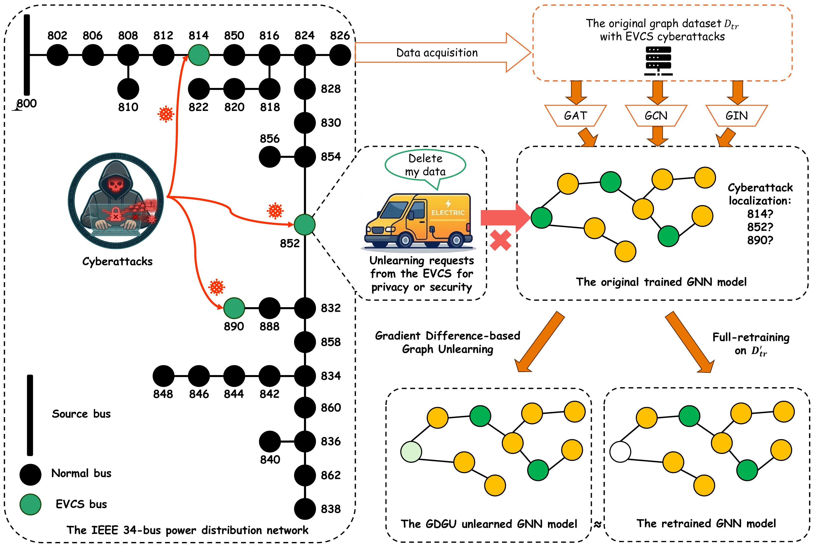

# GDGU: Gradient Difference-based Graph Unlearning for Cyberattack Localization in Electric Vehicle Charging Networks

Code for the paper:

> N. Liu, M. Sun, and J. Zhang, "GDGU: A Gradient Difference-based Graph Unlearning Method for Cyberattack Localization in Electric Vehicle Charging Networks," submitted to *IEEE Transactions on Smart Grid*, 2026.

---

## Overview

Charging manipulation attacks (CMAs) on electric vehicle charging stations (EVCSs) alter charging profiles and, through the power flow, the bus voltages of a distribution feeder. This project addresses **EVCS cyberattack localization** as a **graph-level multi-label classification** task: given a daily feeder snapshot with bus voltage and charging power features, predict which EVCS buses are under attack.

**Unlearning is formulated under split data ownership:** the DSO owns bus voltage $V$ on every bus (never revoked), while each EVCS operator owns the charging power $P$ at its own station — the only revokable modality. A forget request is realized as **feature-level unlearning**: the charging power block at the requested buses is zeroed, while voltage features and graph topology remain intact. Cumulative scenarios $\mathrm{S}_1, \dots, \mathrm{S}_K$ forget the first $j$ EVCS buses as deletion requests accumulate.

<p align="center">
  
</p>
<p align="center"><em>The Framework of GDGU for EVCS cyberattack localization.</em></p>

### Methods compared

| Method | Approach |
|---|---|
| **Original** | Trained model before any forgetting (reference) |
| **Retrain** | Full retraining from scratch on the modified data (gold standard) |
| **GDGU** (ours) | First-order gradient-difference correction $\Delta\theta = \Delta\mathbf{g}/\lambda$ with norm clip $\rho$ → BatchNorm recalibration → recovery fine-tuning |
| **GIF** | Second-order influence correction via truncated Neumann series (Hessian-vector products) |
| **IDEA** | Second-order certified correction + recovery fine-tuning |

### Model

Three GNN backbones with a shared architecture: **GCN, GAT, GIN** — 3 convolution layers with batch normalization and dropout, mean+max dual pooling, 2-layer localization head, plus an auxiliary attack-type head trained jointly ($\mathcal{L} = \mathcal{L}_{\text{loc}} + 0.5\,\mathcal{L}_{\text{type}}$).

---

## Setup

Python 3.10, CUDA 12.1.

```bash
pip install torch==2.5.1+cu121 --index-url https://download.pytorch.org/whl/cu121
pip install torch-scatter==2.1.2 torch-sparse==0.6.18 \
            torch-cluster==1.6.3 torch-spline-conv==1.2.2 \
            -f https://data.pyg.org/whl/torch-2.5.1+cu121.html
pip install -r requirements.txt
```

---

## Data

Raw data is **not tracked by Git**. Source: the EVCS cyberattack dataset of the [PowerBench benchmark](https://zenodo.org/records/15401290) (Jacob et al., 2025).

| | 34-bus | 123-bus | 8500-node |
|---|---|---|---|
| Buses $N$ / lines $M$ | 37 / 36 | 132 / 131 | 4,876 / 4,874 |
| Graph instances | 2,000 | 4,000 | 1,000 |
| EVCS buses $K$ | 3 | 5 | 7 |
| Unlearning scenarios | S1–S3 | S1–S5 | S1–S7 |
| Backbones | GAT, GCN, GIN | GAT, GCN, GIN | GCN, GIN |

**Feature construction:** each node feature concatenates a voltage block and a charging power block, $\mathbf{x}_v = [\mathbf{v}_v \,\|\, \mathbf{p}_v] \in \mathbb{R}^{576}$, where each block stacks the 288 five-minute samples spanning the 24-hour daily snapshot. $P$ is nonzero only at EVCS buses. $V$ and $P$ are standardized with separate scalers fit on the training set.

---

## Experiment Design

| Parameter | Value |
|---|---|
| Split | 70 / 15 / 15|
| Seeds | 10 |
| Optimizer | Adam, lr $10^{-4}$, weight decay $10^{-4}$ |
| Hidden dim / layers / dropout | 128 / 3 / 0.3 |
| GDGU $\lambda$ / $\rho$ / $E_{\text{ft}}$ | 0.1 / 1.0 / 25 |
| GIF & IDEA $T$ / $\beta$ / $s$ | 50 / 0.05 / 200 |

**Metrics:** macro ROC-AUC and F1 over the $K$ EVCS buses (utility); loss-based MIA restricted to the forgotten labels, where MIA-AUC closer to 0.5 indicates stronger forgetting (privacy); unlearning time and peak GPU memory (efficiency).

---

## References

- R. A. Jacob, M. J. Uddin, D. R. Olojede, B. Coskunuzer, and J. Zhang. "PowerBench: A Benchmark Suite for Monitoring and Security in Distribution Systems." 2025. DOI: [10.5281/zenodo.15401290](https://zenodo.org/records/15401290)
- J. Wu et al. "GIF: A General Graph Unlearning Strategy via Influence Function." *WWW 2023*.
- Y. Dong et al. "IDEA: A Flexible Framework of Certified Unlearning for Graph Neural Networks." *KDD 2024*.
- B. Fan et al. "OpenGU: A Comprehensive Benchmark for Graph Unlearning." 2025.

